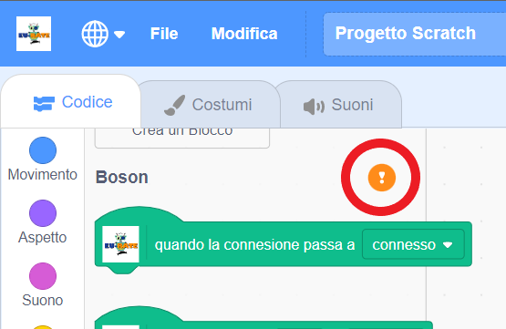

# How to use Boson

## Preparation of the micro:bit

### 1. write a program to the micro:bit
Connect the micro:bit to your computer with a USB cable, and write the latest program for Microbit More to the micro:bit. (You only need to paste the program onto the micro:bit once, and after that, you can connect the micro:bit only by using Scratch.)

Program for Boson by Microbit More [microbit-mbit-more-v2-0_2_4.hex](https://github.com/eu-rate-boson/pxt-mbit-more-v2/releases/download/0.2.4/microbit-mbit-more-v2-0_2_4.hex)

### 2. Adjusting the direction sensor of the micro:bit
Immediately after writing the program, "TILT TO FILL SCREEN" will be displayed on the LED screen to adjust the direction sensor. Tilt the micro:bit back and forth, left and right, so that all the LEDs are glowing. (You will not be able to connect the scratch until you have completed this adjustment.)

## Connect the micro:bit.

### 1. Open Boson

Open https://eu-rate-boson.github.io/editor in your web browser.
(If you are using a browser that does not support the Web Bluetooth API (such as FireFox or Safari), install and run [Scratch Link](https://scratch.mit.edu/microbit) on that computer.)

### 2. Find your micro:bit

Press the Connect button in the 'Boson' category to find a nearby micro:bit with Microbit More hex file written on it.

### 3. Select your micro:bit

Select the name of the micro:bit you want to connect (the 5 alphabet letters that run on the LED) from the list of micro:bits and press 'Pairing'.
When the connection is established, press the "Go to Editor" button.

### 4. Confirm the connection.

Click "Show pattern ♡" to see which micro:bit is connected.

____
## Use it offline

The Boson editor is a PWA (Progressive Web Apps), so you can use it offline.
If you open the editor (https://eu-rate-boson.github.io/editor) an install button will appear in the address bar.

After the install button appears, the entire editor is cached in your browser, so even if you don't install it, you can use Boson without net access.
